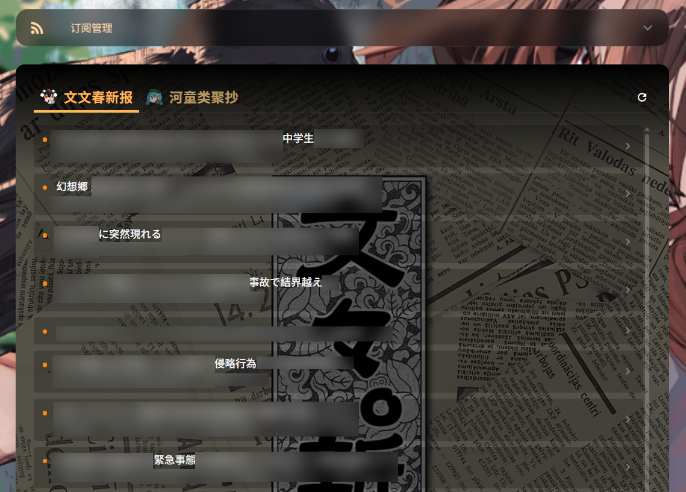

# Touhou RSS Panel 

> 幻想乡首屈一指的 RSS管理面板！！

> 新文性、实在性、报道性，为大家带来世界的真实的电子报纸！


## ✨ 特性

- **RSS分类**：天狗与河童附身的，双分类的Tab功能。请不要将本报纸与其它天狗与妖怪的报道混为一谈。

## 快速开始

### 1. 克隆项目
```bash
git clone https://github.com/UESTC-TOUHOU/Touhou-RSS-Panel.git
cd Touhou-RSS-Panel

```

### 2. 启动服务

```bash
docker-compose up -d --build

```

### 3. 访问看板

打开：`http://localhost:5005` 


## 配置说明

所有配置均位于 `app/config.json`。首次运行会自动生成默认配置。

### 1. 修改 RSS 订阅源

你可以直接修改文件，或在网页端点击“订阅管理”添加。


### 2. 修改背景与 Banner (图片配置)

在 `ui_settings` 中修改 URL。支持网络图片 (URL) 或本地图片。

**使用本地图片的方法：**

1. 将图片放入 `app/static/` 文件夹（例如 `background.jpg`）。
2. 按照config.example.json的指示进行修改。


## 免责声明与版权协议

原作 上海爱丽丝幻乐团

项目中仅包含获得许可的美术资源。


## 技术栈

> 我说gemini太好用了

## 效果预览



### 效果预览中展示的背景图片
1.  https://bunbunmaru-np.com/2026calendar/
2.  https://thwiki.cc/%E5%88%86%E7%B1%BB:%E4%B8%9C%E6%96%B9%E6%96%87%E6%9E%9C%E7%9C%9F%E6%8A%A5#/media/%E6%96%87%E4%BB%B6:%E6%96%87%E6%96%87%E6%98%A5%E6%96%B0%E6%8A%A5%EF%BC%88%E5%B0%81%E5%BA%95%EF%BC%89.jpg
